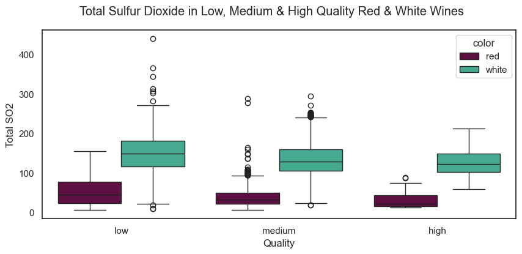

# Sulfur Dioxide Exploration

Intro to data and concept

----

I have focused most of my exploration on the levels of **sulfur dioxide** (SO2) present in the wines. Sulfur dioxide is a natural by-product of the fermentation process, but it is also a chemical commonly added to wine to ensure freshness. It is antibacterial, and prevents further fermentation and oxidization, acting as a preservative. 

Sulfur is a reactive chemical, and the sulfur dioxide becomes "bound" when it is activated, meaning the effectiveness is limited to the quantity. Once all the molecules are bound, the wine is more prone to spoiling. The bound SO2 that stays present in the wine can also have various effects, changing the mouthfeel, aroma, colour, and even the very flavour of the wine. With some of these effects being quite desirable, others are less so, and so more research is currently being conducted for concrete understanding and prediction. 

---

This box plot shows the total sulfur dioxide present in the red and white wine datasets, divided into categories of high, medium and low quality. It is immediately clear that red wine has less SO2, which is an interesting fact given the common misconception to the contrary! Red wine needs less added SO2 as it generally has a higher tannin content and undergoes a fermentation method that gives it a natural protection against the chemical changes SO2 are added to prevent. 

This, combined with the red wine dataset being much smaller (a natural result of the Vinho Verde region in Portugal being much less known for red wine production), is the justification I give for focusing my analysis almost exclusively on white wines from this point onward. 

---

Sulfites != Sulphates, which is also a feature in the dataset. But do they mean sulfites?
high residual sugar = high bound SO2 (sugar can continue to ferment, SO2 prevents this)

Naturally, winemakers want their wine to stay as fresh as possible - so the more SO2, the longer their product will last! For health reasons, there are limits placed on how much SO2 per litre is allowed, though this varies quite dramatically between regions.

References:
- https://daily.sevenfifty.com/how-sulfites-affect-a-wines-chemistry/
- https://grape-to-glass.com/index.php/sulphur-levels-wine/
- https://www.aromadictionary.com/articles/sulfurdioxide_article.html