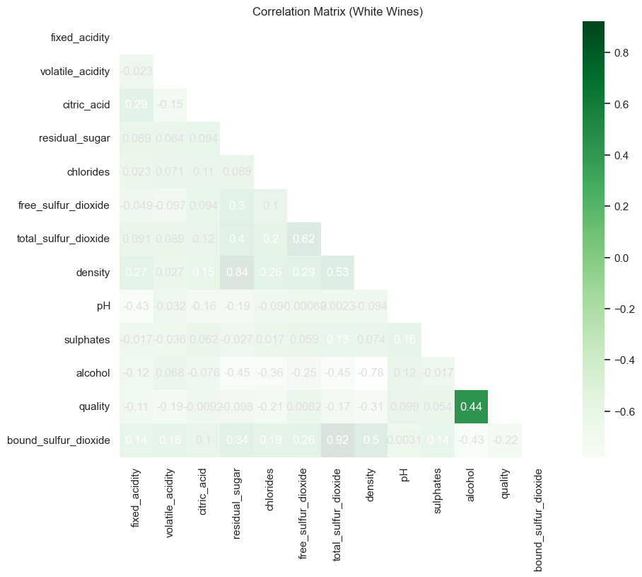

# Sulfur Dioxide Exploration

Intro to data and concept

Hello, my name is Emily and I am an intern for Blueberry Winery. I have been tasked with helping the department of Analytics and Research to determine the quality of wines based on their composition.

The data I have to work with is broken into two datasets: red wines and white wines. The white wine dataset (4898) far exceeds the red wine dataset (1599) in terms of size. They each include 12 columns: 

- Fixed acidity (tartaric acid)
- Volatile acidity (acetic acid)
- Citric acid 
- Residual sugar
- Chlorides (Sodium Chloride NaCl/table salt)
- Free Sulphur Dioxide (SO2)
- Total Sulphur Dioxide
- Density
- pH
- Sulphates (Potassium Sulphate K2O2S)
- Quality

----

We are looking for patterns linked to the quality rating for the purpose of standardizing the bottle price. If we break the quality rating into 3 sub-groups: low, medium, and high, we can see the distribution of ratings is very unbalanced in favour of medium quality wines. This is true for both datasets.

This can probably be attributed to the intended consumers of the wine - Vino Verde translates to "young wine", released only 3-6 months after harvest, they tend to be fresh but without much complexity, and so make for better lunchtime and casual drinking. 

---

I have focused most of my exploration on the levels of **sulfur dioxide (SO2)** present in the wines. Sulfur dioxide is a natural by-product of the fermentation process, but it is also a chemical commonly added to wine to ensure freshness. It is antibacterial, and prevents further fermentation and oxidization, acting as a preservative. 

Naturally, winemakers want their wine to stay as fresh as possible - so the more SO2, the longer their product will last! For health reasons, there are limits placed on how much SO2 per litre is allowed, though this varies quite dramatically between regions.

Sulfur is a reactive chemical, and the sulfur dioxide becomes "bound" when it is activated, meaning the effectiveness is limited to the quantity. Once all the molecules are bound, the wine is more prone to spoiling. The bound SO2 that stays present in the wine can also have various effects, changing the mouthfeel, aroma, colour, and even the very flavour of the wine. While some of these effects are quite desirable, others are less so, and so more research is currently being conducted for a more concrete understanding and prediction potential for it's use.

---

This box plot shows the total sulfur dioxide present in the red and white wine datasets, divided into categories of high, medium and low quality. It is immediately clear that red wine has less SO2, which is an interesting fact given the common misconception to the contrary! Red wine needs less added SO2 as it generally has a higher tannin content and undergoes a fermentation method that gives it a natural protection against the chemical changes SO2 are added to prevent. 

This, combined with the red wine dataset being much smaller (a natural result of the Vinho Verde region in Portugal being much less known for red wine production), is the justification I give for focusing my analysis almost exclusively on white wines from this point onward.

We should also compare the impact of free and bound SO2 on the quality of white wines. The value of the bound SO2 can be calculated by simply deducting the free SO2 from the total.

It is subtle, but there is a clear pattern to indicate that as more SO2 is bound in the wine, the quality rating lowers. The remaining free SO2 does not appear to have much affect. 

---

Sulfur dioxide will directly affect other aspects of the wine's chemical composition. If we create a correlation matrix, we can look to see some of these relationships, and discuss how they can influence the quality rating.

 

The highest correlation of any feature on 'quality' is 'alcohol'. If we then target only features that have some correlation with alcohol, we can focus our assessment on those, and whether SO2 levels have any impact:

- density (-0.78)
- residual sugar (-0.45)
- bound SO2 (-0.43)
- total SO2 (-0.45)

Usually we would hope to have a correlation difference of more than 0.5 to be relevant, but since we're working with such slim pickings I reduced it to 0.4. All of these features (apart from quality) have a negative correlation. I will need to use some of the knowledge I gained from my domain research to explain.

---

**Density** is negatively correlated because alcohol is physically a less dense substance than water, which makes up the remaining majority of the wine volume. Density can affect mouthfeel, but I struggled to find much information about what else this quality contributes in terms of how the wine is enjoyed and then rated. 

Curiously, density has a heavy positive correlation with residual sugar. 

My understanding is that it would be the opposite... My first theory was that perhaps Vino Verde wines simply have a higher starting sugar quantity, but my domain research on the region immediately contradicts this. Vino Verde wines are harvested under ripe, meaning they tend to have _less_ sugar! But they also tend to be fermented for less time, providing less time for sugar to become alcohol. The addition of SO2 and sulphates prevent further fermentation after bottling, so the sugar content will remain consistent. This is what makes them such dry wines, and keeps their alcohol content fairly low. 

**Residual sugar** is negatively correlated with alcohol because it is the sugar fermenting that creates alcohol! The higher the alcohol content, the more sugar was consumed (meaning there is less left over). We can see how this directly influences the density, and the pattern linked to the quality rating:

Residual sugar obviously contributes to the sweetness of wine. 

In the end, my focus on sulphur dioxide and sulphates didn't lead to any resounding conclusions. It will be added to wines to combat undesirable changes, which can be triggered by the varying levels of other chemicals, but the presence of SO2 itself does not appear too have any independent influence. 

---

References:
- https://daily.sevenfifty.com/how-sulfites-affect-a-wines-chemistry/
- https://grape-to-glass.com/index.php/sulphur-levels-wine/
- https://www.aromadictionary.com/articles/sulfurdioxide_article.html

---

## Machine Learning

### White

White wines I removed the quality column after assigning each quality label an INT label 0-2 (low-high). I also removed the density column as it seemed to communicate the same information as residual sugar. 

**Logistical Regression**: I was able to marginally improve the result by splitting 0.33, and then by standardizing the data values with the `RobustScaler()`.

**Random Forest Classification**: All attempts to improve the initial score failed to improve on the default model settings with a split of 0.2. 

### Red

White wines I removed the quality column after assigning each quality label an INT label 0-2 (low-high). I also removed the density column as it seemed to communicate the same information as residual sugar. Split for both is 0.333.

**Logistical Regression**: Small improvement by standardizing the data values with the `RobustScaler()`.

**Random Forest Classification**: Small improvement by adding `class_weight='balanced_subsample'`.